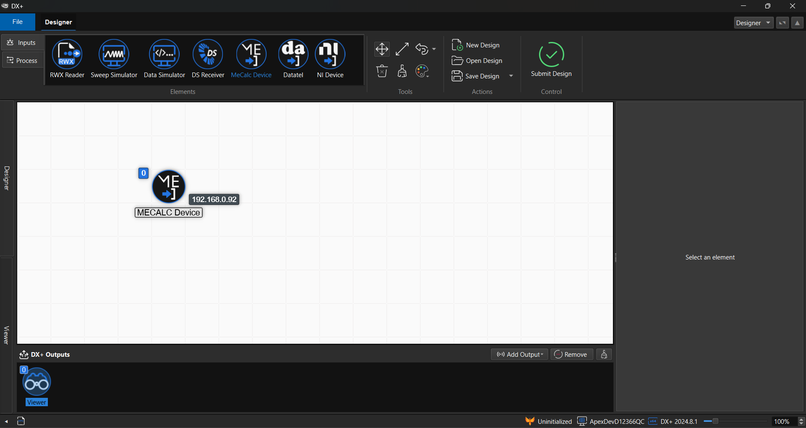

# DX+ OVERVIEW

***

DX+ is a multipurpose test, measurement, analysis, and reporting tool created for use in the aerospace and mechanical engineering industries, with additional application in general purpose data acquisition.

<figure><figcaption>
<strong>Designer</strong> <em>DX+ includes an intuitive building block system for connecting device hardware and routing data through secure networking and storage</em>
</figcaption></figure>

DX+ interfaces with top DAQ hardware manufacturers including National Instruments, VTI, Mecalc, Datatel, and more. Hardware connections to DX+ are made automatically through their respective manufacturer setup panels, enabling quick and convenient setup for channels from multiple devices and types at the same time - all running at different sample rates.

DX+ saves to open databases, enabling fast and secure data queryability, and enterprise level distribution. APEX supports SQLite databasing for light, powerful, and shareable applications and PostgreSQL for comprehensive enterprise-level distribution and security.

### Jump right in

<table data-view="cards"><thead><tr><th></th><th></th><th data-hidden data-card-cover data-type="files"></th><th data-hidden></th><th data-hidden data-card-target data-type="content-ref"></th></tr></thead><tbody><tr><td><strong>Getting Started</strong></td><td>Requirements &#x26; Installation</td><td><a href=".gitbook/assets/3.png">3.png</a></td><td></td><td><a href="getting-started/installing-and-licensing.md">installing-and-licensing.md</a></td></tr><tr><td><strong>Designer</strong></td><td>DX+ Designer Overview</td><td><a href=".gitbook/assets/2.png">2.png</a></td><td></td><td><a href="broken-reference">Broken link</a></td></tr><tr><td><strong>Viewer</strong></td><td>DX+ Viewer Overview</td><td><a href=".gitbook/assets/1.png">1.png</a></td><td></td><td><a href="./">.</a></td></tr></tbody></table>
