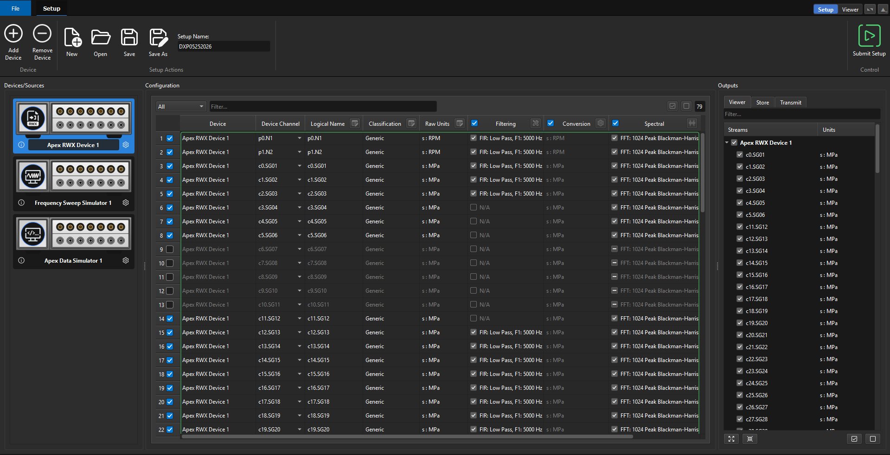

---
layout:
  title:
    visible: true
  description:
    visible: false
  tableOfContents:
    visible: true
  outline:
    visible: true
  pagination:
    visible: true
---

# DX+ DAQ

<figure><figcaption>
The DX+ DAQ Setup tab — click the link below to access DAQ documentation
</figcaption></figure>


