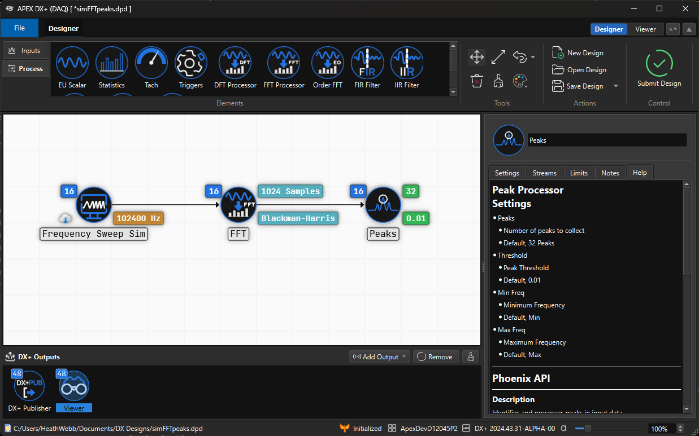

---
layout:
  title:
    visible: true
  description:
    visible: false
  tableOfContents:
    visible: true
  outline:
    visible: true
  pagination:
    visible: true
---

# DX+ DESIGNER

<figure>

<figcaption>
The DX+ Design Elements are powered by APEX Phoenix Components

</figcaption>
</figure>

<a href="https://apexturbine.gitbook.io/phoenix-documentation">
<figure><figcaption>
Click the image or the link below for Phoenix Components documentation
</figcaption></figure>
</a>


