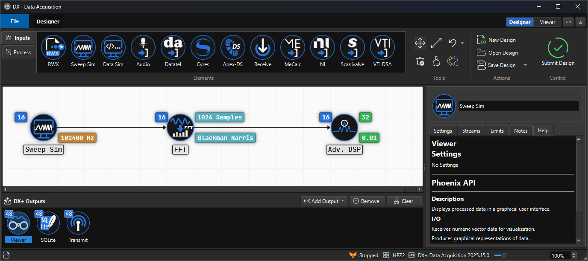
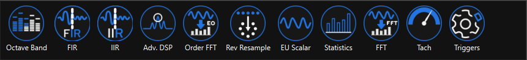

---
layout:
  title:
    visible: true
  description:
    visible: false
  tableOfContents:
    visible: true
  outline:
    visible: true
  pagination:
    visible: true
---

# DX+ DESIGNER

<figure><figcaption>
The DX+ Design Elements are powered by APEX Phoenix Components
</figcaption></figure>

<figure><figcaption>
Click the link below for Phoenix Components documentation
</figcaption></figure>


