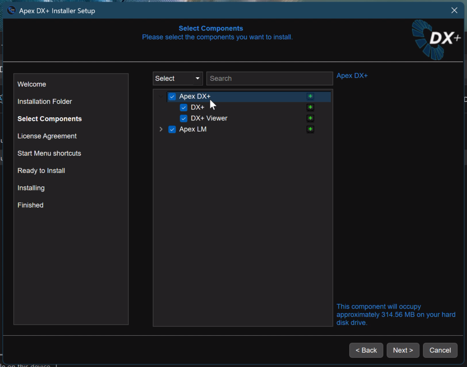
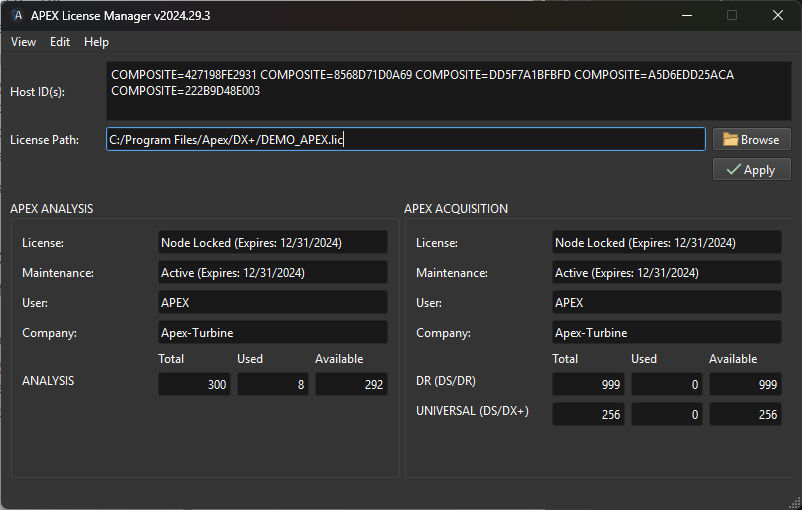
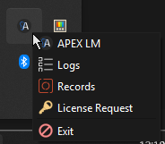

# Installing & Licensing

## Windows Installation

<figure><figcaption>
DX+ Installer
</figcaption></figure>

1. Launch Installer
2. Select Installation Folder
3. Select DX+ and the DX+ Viewer
4. Select ApexLM (_our required License Manager)_
5. Install

## Windows Licensing with ApexLM

<figure><figcaption></figcaption></figure>

1.  Open ApexLM from the System Tray

    * Right click the **A** icon and select APEX LM&#x20;

    <figure><figcaption></figcaption></figure>
2. If you have a Demo License, click Browse and select the license file
3. Click Apply
4. Tokens will become available for use

