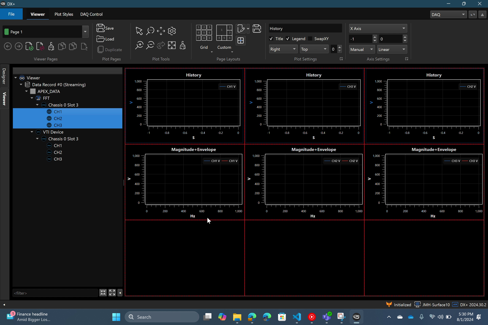

# Quick Start Guide

The Quick Start Guide is available as&#x20;

1. [a video guide](quick-start-guide.md#id-1.-quick-start-video) or&#x20;
2. [a step-by-step guide with text & screenshots](quick-start-guide.md#id-2.-step-by-step-text-and-screenshot-guide)

## 1. Quick Start Video:



## 2. Step-By-Step Text & Screenshot Guide:

## DX+ Designer

<figure><figcaption></figcaption></figure>

Upon launching DX+ we see the Designer. From here we can drag down input elements and begin building a design.

## Input: Device Element

For this example we will use the VTI DSA Device element.

<figure><figcaption></figcaption></figure>

Once the element is created, we can connect to the device.

1. Enter the IP Address of the device
2. Leave the Slots field blank to enable all slots, otherwise you can specify slots by slot number in a comma separated list
3. Click the Pull Setup button to pull current channel settings, time stamps, and any additional information from the device
4. The element's badge is updated to show the total number of channels

<figure><figcaption></figcaption></figure>

## Taking a look at some of the other VTI Settings:

* Allow invalid calibration checkbox
  * This is required to be checked to be able to connect and perform the measurement operation on the 4380 card that we have.
  * If you disable this and if the calibration is invalid, then it will not allow you to run. You'll get an error message on your setup step.
* FIFO Mode
  * Stop (the default setting)
    * If the FIFO overflows, it's going to stop the acquisition.&#x20;
  * Overwrite
    * Overwrites the data in the FIFO . This prevents an overflow but allows for data loss.
  * Wait
    * Makes the FIFO wait for reading before adding more data to the fifo. This prevents data loss, but if the client can't keep up, the memory usage will increase until eventual application or system crash.
* Channel List Dropdown
  * Shows a list of all channels in the Setup
  * Allows you to change settings on a per channel basis or Apply All
    * Function
      * selection of IEPE enables a field for setting Excitation Current
      * selection of Strain enables all available options for Strain mode (gauge resistance, gauge factor, etc.)
    * Sample Rate&#x20;
      * all channels on a card must have the same sample rate
    * Coupling
    * Mode
    * Range

<figure><figcaption></figcaption></figure>

## Output: Viewer Element

Next we will add an output element to view the data

1. In the DX+ Outputs pane, click the Add Output dropdown button
2. Select the Viewer element


Other outputs are also available

* SQLite Database - allows you to store the data to disk
* DX+ Publisher - allows you to publish data onto the network which can be seen by the DX+ Standalone Viewer


<figure><figcaption></figcaption></figure>

## Processing: FFT Element

Next we will add an FFT element to process the data

1. In the Elements pane, switch from the Inputs tab to the Process tab
2. Drag down an FFT element and place it beside the VTI Device element
3. Click the diagonal arrow icon in the Tools pane to enter Connect Mode
4. Click and drag from the VTI Device element to the FFT element and release the mouse button
5. Now data will flow through the design in the direction of the arrow you created

<figure><figcaption></figcaption></figure>

## Disabling Channels

* Channels can be disabled inside each element to prevent their propagation and continued processing downstream
* The total channels present in each element is shown in the element's blue badge

## Save Design

When the design is set up according to your needs, it would be wise to save the design so you can revisit it later without having to recreate it from scratch.

1. Click the File Menu button
2. Click Save Design
3. Choose a filename and location
4. Click Save

<figure><figcaption></figcaption></figure>

## Submit Design

1. When you are ready to submit your design, simply click the Submit Design button in the upper right area of the Ribbon
2. The design will be validated and all settings will be submitted to the device
3. Once the process is complete, the green circle icon on the Submit Design button will stop spinning


Changes made to an element's settings requires the design to be re-submitted


## DX+ Viewer

<figure><figcaption></figcaption></figure>

1. Go to the Viewer by clicking the Viewer tab on the leftmost edge of the DX+ window
2. Notice the channels appear in the Signal Pane on the left
   * They are available as FFT processed signals and also as raw signals from the device
3. Select a plot space in the Viewer Canvas
4. Use the Ctrl+A keyboard shortcut to select all spaces
   * If multiple spaces are not present, you can create them to match the screenshot by clicking the Grid icon in the ribbon and selecting the 3x3 configuration
5. Select 3 signals from the device and drag them to the top left plot space
6. Click the '1 trace Per ' button and select History as the plot type
7. Repeat the process for the FFT processed signals and select Mag+Env as the plot type
8. The result should look like this:

<figure><figcaption></figcaption></figure>


Available plot types are determined by the data type of the underlying stream. E.g.

* FFT data can be plotted as Magnitude, Envelope, Mag+Env, Campbell, Zmod, & Bar
* Time-based data can be plotted as Time, History, Strip, & Graphic (Gauge, Text, Thermometer, LEDs)


<figure><figcaption></figcaption></figure>

## DAQ Control

1. Navigate to the DAQ Control tab at the top of the ribbon bar
2. Click the Start button in the upper left corner
3. DX+ will start acquiring data from the device&#x20;
4. Notice the plots are showing the data in realtime
5. Return to the Viewer tab and change the Grid configuration to be 2x3 to maximize the area of your plots on the canvas
6. Return to the DAQ Control tab and take note of the System Usage gauges
7. Click the Stop button to stop acquiring data and note the change in the System Usage gauges

## Conclusion

By following this guide, you should have an understanding and familiarity with the basic operations of DX+, but of course there are many more features and use cases to be explored.&#x20;

Please continue through the documentation, search for terms, or reach out to us if you have further questions.

